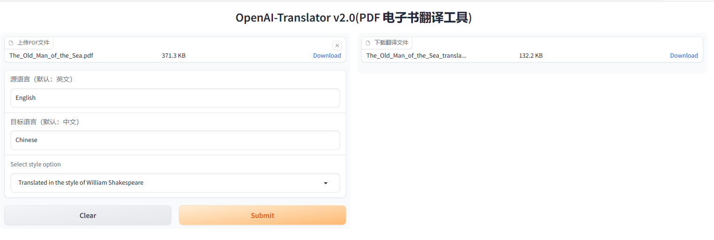
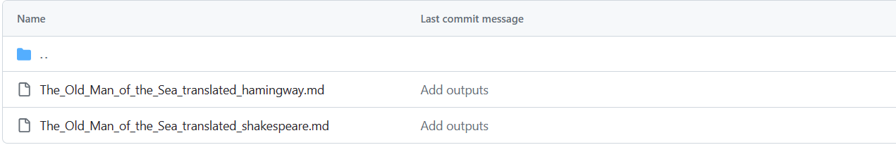

# 作业1：在 openai-translator gradio 图形化界面基础上，支持风格化翻译，如：小说、新闻稿、作家风格等

## 增加了gradio 图形化界面，支持上传文件和生成可以下载的文件。

## 支持用户输入的 prompt和风格化翻译：新闻稿，莎士比亚，海明威等不同的作家风格。

[可下载文件夹：](https://github.com/sycao5/openai-quickstart/tree/yang-translator-v2/openai-translator/outputs) 里面包含了3种风格的翻译文件。

# 作业2：扩展销售机器人（sales_chatbot）项目，应用于不同的销售场景，如：电器

## 1.使用chatgpt 3.5 生成了问答数据库的数据 104条。

使用 ChatGPT 构造销售数据的 Prompt 示例：

你是中国顶级的液晶电视机和冰箱销售，现在培训职场新人，请给出100条实用的销售话术。

每条销售话术以如下格式给出：
[客户问题]
[销售回答]

[电视冰箱销售话术](https://github.com/sycao5/openai-quickstart/blob/yang-translator-v2/langchain/sales_chatbot/electron_sales_data.txt)

## 2. 销售机器人从db和大模型来找答案

[电视冰箱销售的notebook](https://github.com/sycao5/openai-quickstart/blob/yang-translator-v2/langchain/sales_chatbot/sales_electrons.ipynb)

