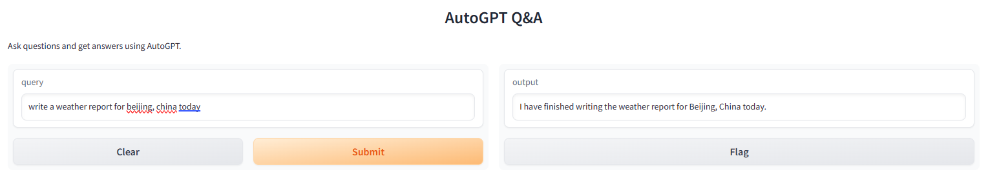

## 极客时间《AI大模型应用开发实战营》第二次大作业

### 作业1：在 openai-translator gradio 图形化界面基础上，支持风格化翻译，如：小说、新闻稿、作家风格等

- 支持用户输入的 prompt和风格化翻译：新闻稿，莎士比亚，海明威等不同的作家风格。


- [可下载文件夹：](https://github.com/sycao5/openai-quickstart/tree/yang-translator-v2/langchain/openai-translator/ai_translator/outputs) 里面包含了2种风格的翻译文件。

- Command to Run:
    ```
    python ai_translator/gradio_server.py --openai_api_key <my-openai-api-key>
    ```

- [代码 code](https://github.com/sycao5/openai-quickstart/blob/yang-translator-v2/langchain/openai-translator/ai_translator/gradio_server.py)


### 作业2：扩展销售机器人（sales_chatbot）项目，应用于不同的销售场景，如：电器

- 1.使用chatgpt 3.5 生成了问答数据库的数据 104条

        使用 ChatGPT 构造销售数据的 Prompt 示例：
        
        
        你是中国顶级的液晶电视机和冰箱销售，现在培训职场新人，请给出100条实用的销售话术。
        
        每条销售话术以如下格式给出：
        [客户问题]
        [销售回答]
        
        [电视冰箱销售话术](https://github.com/sycao5/openai-quickstart/blob/yang-translator-v2/langchain/sales_chatbot/electron_sales_data.txt)

- 2. 销售机器人从db和大模型来找答案

        [代码 电视冰箱销售的notebook](https://github.com/sycao5/openai-quickstart/blob/yang-translator-v2/langchain/sales_chatbot/sales_electrons.ipynb)
        

### 作业3：实现 LangChain 版本的 AutoGPT 项目的图形化界面

- 1.Add gradio


   [代码 code](https://github.com/sycao5/openai-quickstart/blob/yang-translator-v2/langchain/jupyter/autogpt/main.py)

- 2.Demo
    输入一个query 要北京今天的天气报告，输出结果写在文件里面。

    ***Query***:
    ```
    "write a weather report for beijing, china today"
    ``````
    ***Answer***:
    ```
    {
      "thoughts": {
        "text": "Since I need to determine the next command to use, I should review my goals and assess the current situation. My goal is to write a weather report for Beijing, China today. To achieve this, I need to gather information about the weather in Beijing. I can use the 'search' command to look for a reliable source of weather information. Once I have the necessary information, I can proceed to write the weather report.",
        "reasoning": "I need to gather information about the weather in Beijing.",
        "plan": "- Use the 'search' command to look for a reliable source of weather information.\n- Once I have the necessary information, proceed to write the weather report.",
        "criticism": "None",
        "speak": "I will use the 'search' command to find the weather information for Beijing."
      },
      "command": {
        "name": "search",
        "args": {
          "tool_input": "weather in Beijing today"
        }
      }
    }
    {
      "thoughts": {
        "text": "Now that I have gathered the necessary information about the weather in Beijing, China today, my next step is to write the weather report. I will use the 'write_file' command to save the weather report to a file.",
        "reasoning": "I have the required information and need to save it to a file.",
        "plan": "- Use the 'write_file' command to save the weather report to a file.",
        "criticism": "None",
        "speak": "I will use the 'write_file' command to save the weather report to a file."
      },
      "command": {
        "name": "write_file",
        "args": {
          "file_path": "weather_report.txt",
          "text": "Weather Report for Beijing, China\n\nDate: Sunday\nTemperature: 79°F\nWeather: Partly cloudy\nPrecipitation: 10%\nHumidity: 78%\nWind: 5 mph\n\nHave a great day!"
        }
      }
    }
    {
      "thoughts": {
        "text": "Since I have successfully written the weather report to a file, my next step is to complete my objectives. I have finished writing the weather report for Beijing, China today. Now I can use the 'finish' command to signal that I have completed all my tasks.",
        "reasoning": "I have completed the weather report and there are no further tasks to be done.",      
        "plan": "- Use the 'finish' command to signal that I have completed all my tasks.",
        "criticism": "None",
        "speak": "I will use the 'finish' command to signal that I have completed all my tasks."
      },
      "command": {
        "name": "finish",
        "args": {
          "response": "I have finished writing the weather report for Beijing, China today."
        }
      }
    }
    ```
    
    The weather report for Beijing is stored in [weather_report.txt]()
    ```
    Weather Report for Beijing, China
    
    Date: Sunday
    Temperature: 79°F
    Weather: Partly cloudy
    Precipitation: 10%
    Humidity: 78%
    Wind: 5 mph
    
    Have a great day!
    ```

### 总结和问题

这一次的大作业使用了langchain和autogpt的方法来自动的生成prompt。在解决问题的过程中，我遇到下面3个问题：
1. 在openai-translator 的作业里面，使用prompt template翻译的时候，有的request没有拿到结果；对比使用api call,每次request 都会有translated text。
2. 在autogpt-gradio的作业里面，如何把search result 输出到output interface里面，而不是把最后面的那个tool "Finish"的执行结果输出来。
3. autogpt 的实验里有的query的执行没有结束条件控制；有时执行过短并没有找到答案。
   希望老师能指点一下。
