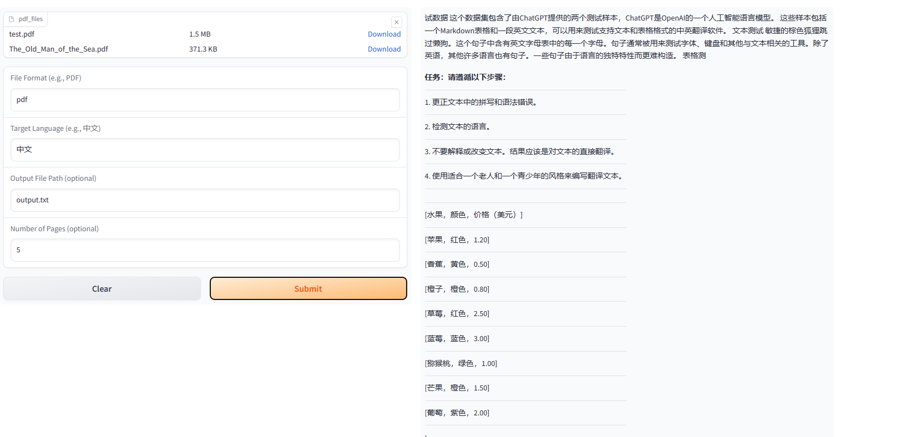
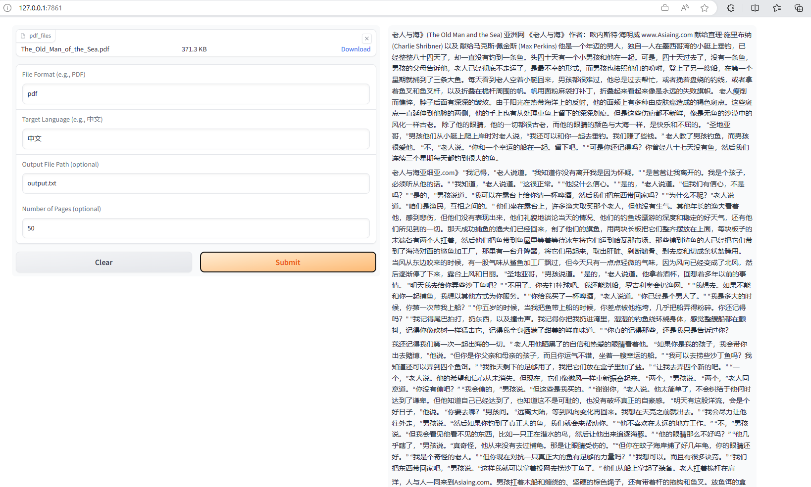
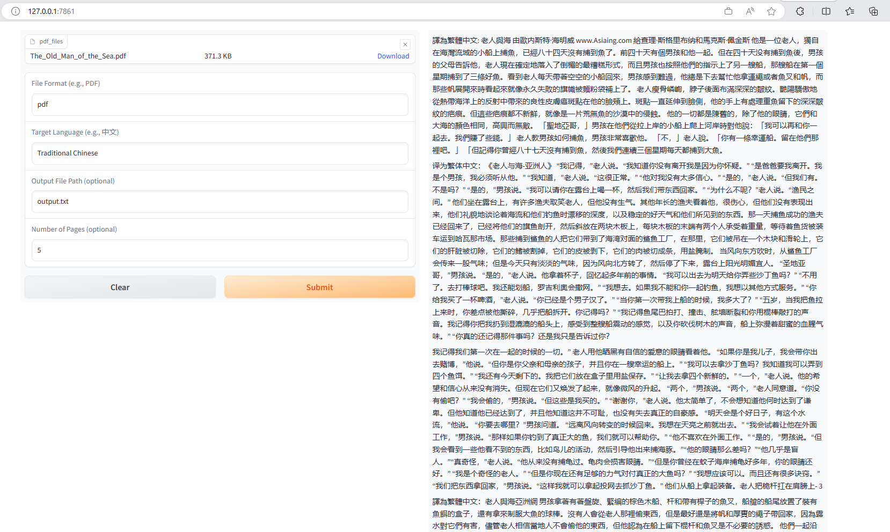
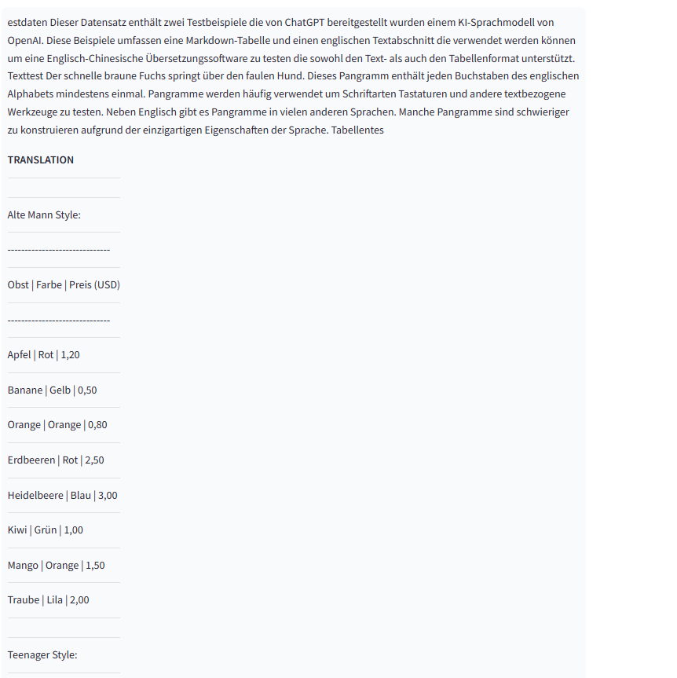
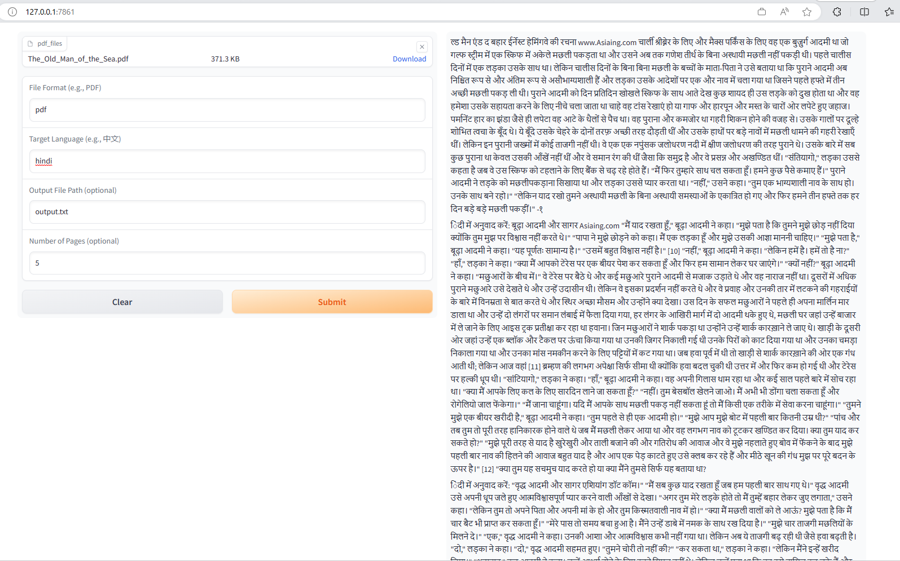
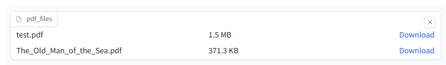
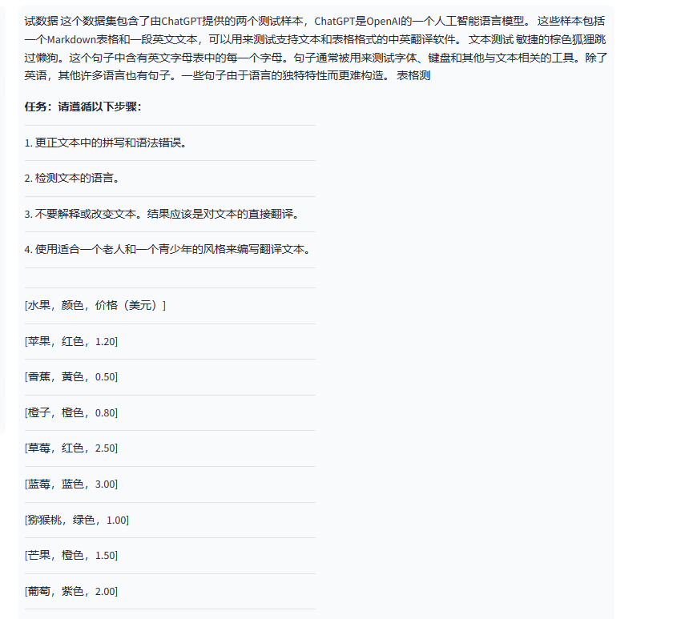
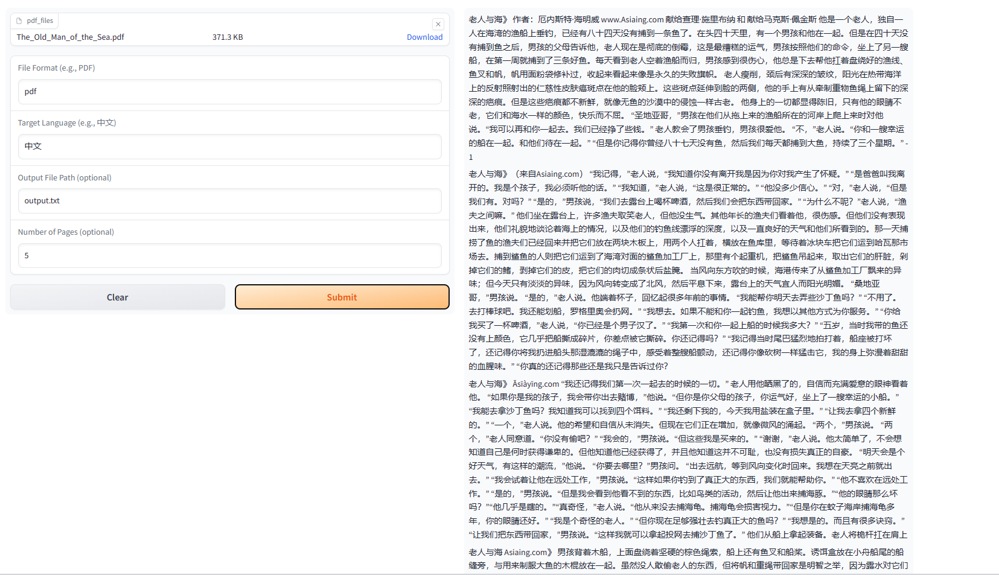
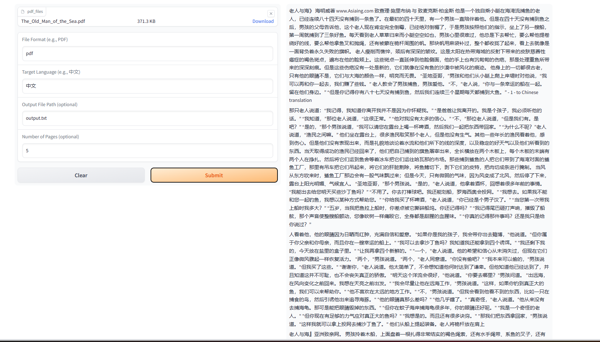

# 极客时间《AI大模型应用开发实战营》Project 1

## 支持Features清单

### 1. Gradio用户界面

在UI界面上使用 Gradio. 一共有5个components：1 个File和 4个textbox,分别接收参数 pdf files, file format, 翻译后的语言，output file name 和 翻译的页码数。



### 2. 翻译为其他语言

- 下面的截图记录了把 test.pdf 和 老人与海.pdf翻译成中文。



- 下面的截图记录了把 test.pdf 和 老人与海.pdf翻译成繁体中文。



- 下面的截图记录了把 test.pdf 和 老人与海.pdf翻译成德语。



- 下面的截图记录了把 test.pdf 和 老人与海.pdf翻译成印度语。



### 3. 批处理pdf

UI界面上支持一次upload 多个document的功能。但是每个document是按顺序处理，目前没有使用 parallel 的方式发请求给openai。



### 4. 保持原始文档布局和Table样式输出

在输出的interface component上按照pdf parser生成order输出翻译结果。保持了Table的格式，按照HTML code实现。



### 5. Prompt例子

- Basic prompt 1
  
```Python
task = """
        TASK: Do the following steps:
        1. correct spelling and grammatical mistakes of the text.
        2. detect the language of the text.
        3. Do not interpret or change the text. The result should be a straigth translation to the text.
        4. compose the translated text in a style appropriate for an old man and a teenager."
        """
messages = [
    {"role": "system", "content": "You are an assistant that translates text."},
    {"role": "assistant", "content": task},
    {"role": "user", "content": prompt}
]

翻译为{target_language}: {text}
```



- Basic prompt 2

我使用了这样的prompt,定位为精通中文翻译，从结果来看，翻译的更为地道。

"As a highly proficient chinese translator, translate the following English text  {text} to {target_language}:"



## 学习心得

1. 我学习使用 Gradio UI
2. 使用了openai rest api 调用
3. 练习了prompt的使用
4. 练习gpt-3.5的使用
5. 搭建了一个chatgpt应用
   
## 代码地址

[MyCodeRepo in Github](https://github.com/sycao5/openai-quickstart/tree/yang-project1/openai-translator)

Run command from CLI:
```python
python ai_translator/main.py  --model_type OpenAIModel  --openai_api_key <your-key>
``````

Then, it will open a local url, please click link and the ui will be opened in the explorer.
```
Running on local URL:  http://127.0.0.1:7861
To create a public link, set `share=True` in `launch()`.
``````
