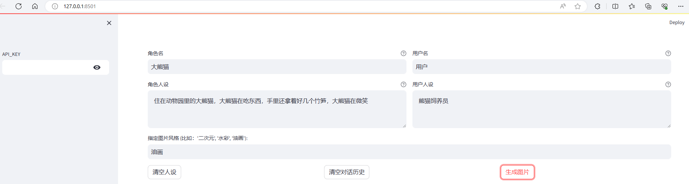
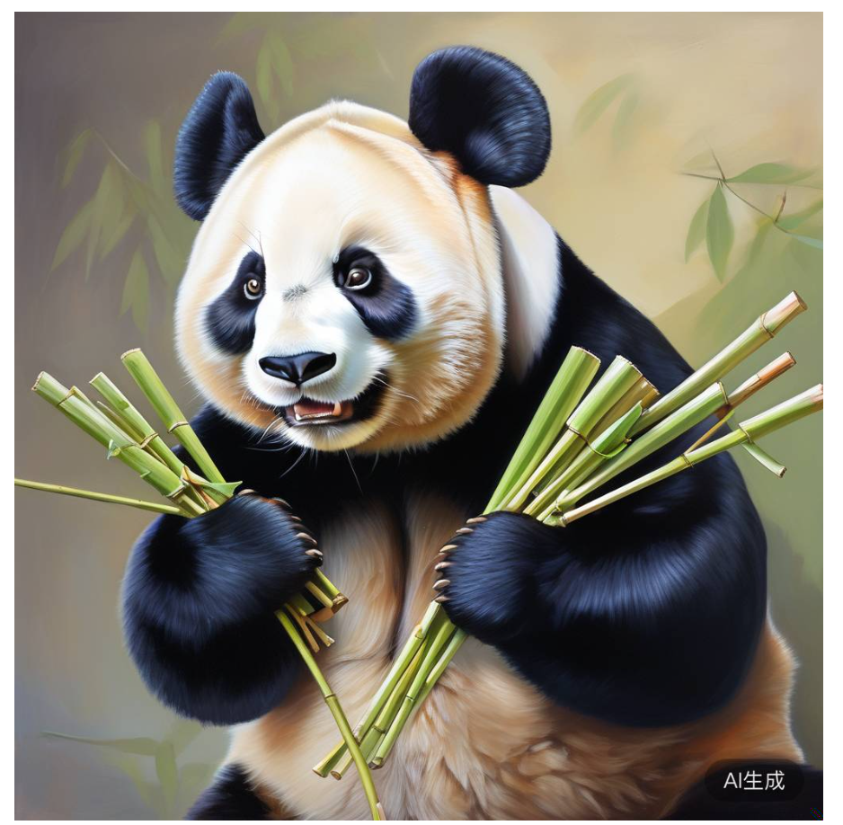
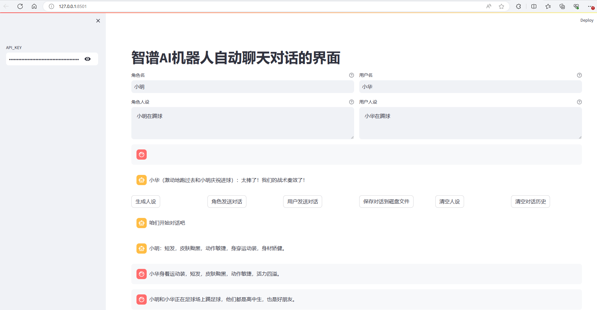
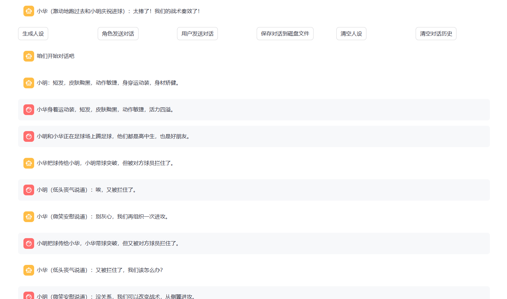
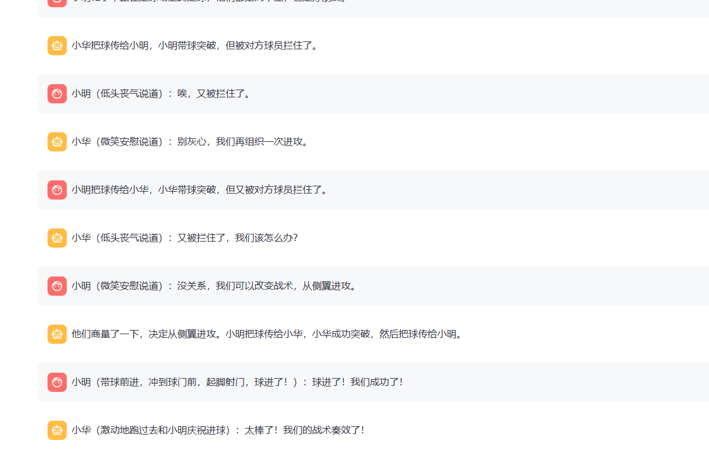

# 作业1

You can now view your Streamlit app in your browser.

URL: http://127.0.0.1:8501

image_prompt = 油画。【生成外貌描写】

文本中没有提供具体的外貌描写。根据“大熊猫”这一提示，我们可以推测这是一只成年雌性大熊猫。

- 性别：雌性
- 年龄：成年
- 外貌描写：黑白相间的毛发，圆润的脸庞，黑色的小眼睛，微微上翘的嘴角，露出满足的微笑。
image_prompt = 油画。【外貌描写】黑白相间的毛皮，圆滚滚的体型，短而粗的四肢，黑色的眼睛，张开嘴时露出的锋利牙齿。
image_prompt = 油画。分析文本后，未直接提供人物外貌描写。根据“大熊猫”这一线索，推测人物为一只成年雌性大熊猫。

它体型圆润，黑白相间的毛发柔软亮泽。圆脸庞上，漆黑的小眼睛闪烁着温和的光芒，嘴角上扬，露出温柔的微笑。四肢短而粗壮，手持几根新鲜的竹笋，憨态可掬。   

油画。分析文本后，未直接提供人物外貌描写。根据“大熊猫”这一线索，推测人物为一只成年雌性大熊猫。 它体型圆润，黑白相间的毛发柔软亮泽。圆脸庞上，漆黑的小眼睛闪烁着温和的光芒，嘴角上扬，露出温柔的微笑。四肢短而粗壮，手持几根新鲜的竹笋，憨态可掬。

代码link: https://github.com/sycao5/openai-quickstart/blob/zhipuhomework/%E6%99%BA%E8%B0%B1AI%20GLM%E7%AF%87/lesson/characterglm_api_demo_streamlit.py

# 作业2

支持的功能：

- 基于一段文本（自己找一段文本，复制到提示词就可以了，比如你可以从小说中选取一部分文本，注意文本要用 markdown 格式）生成角色人设，可借助 ChatGLM 实现。
- 给定两个角色的人设，调用 CharacterGLM 交替生成他们的回复。
- 将生成的对话数据保存到文件中。
- 设计图形界面，通过点击图形界面上的按钮执行对话数据生成，并展示对话数据。

代码Link: https://github.com/sycao5/openai-quickstart/blob/zhipuhomework/%E6%99%BA%E8%B0%B1AI%20GLM%E7%AF%87/lesson/characterglm_role_play_streamlit.py

